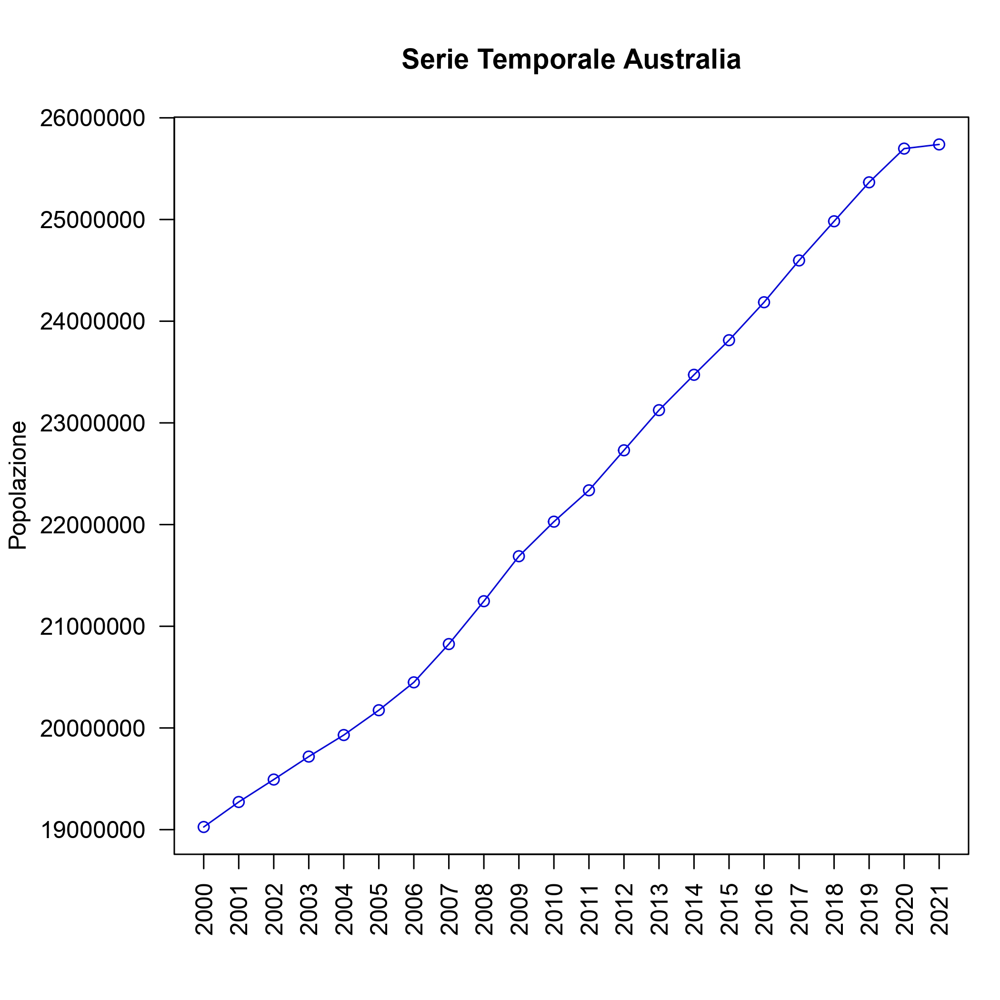
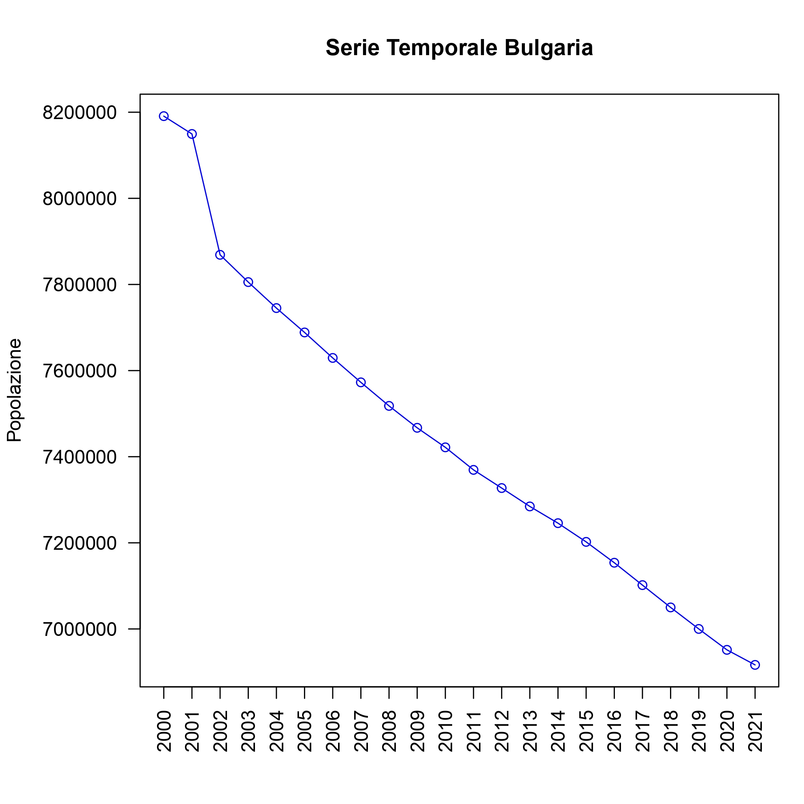
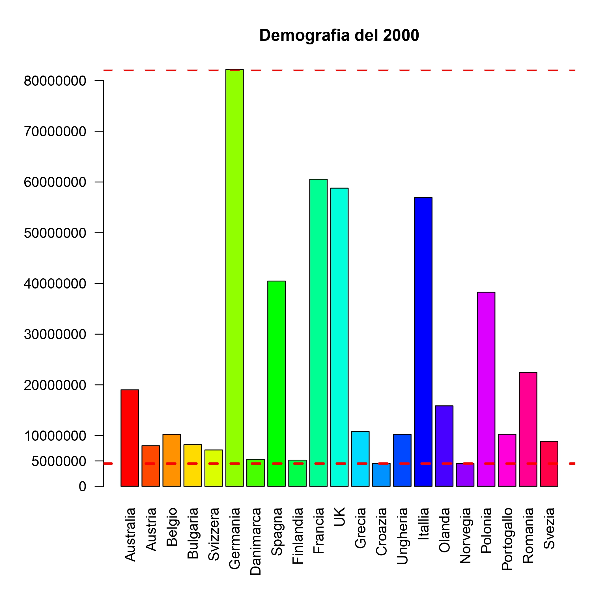
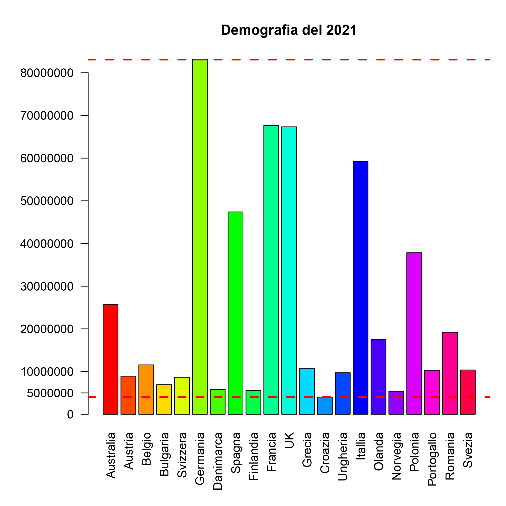
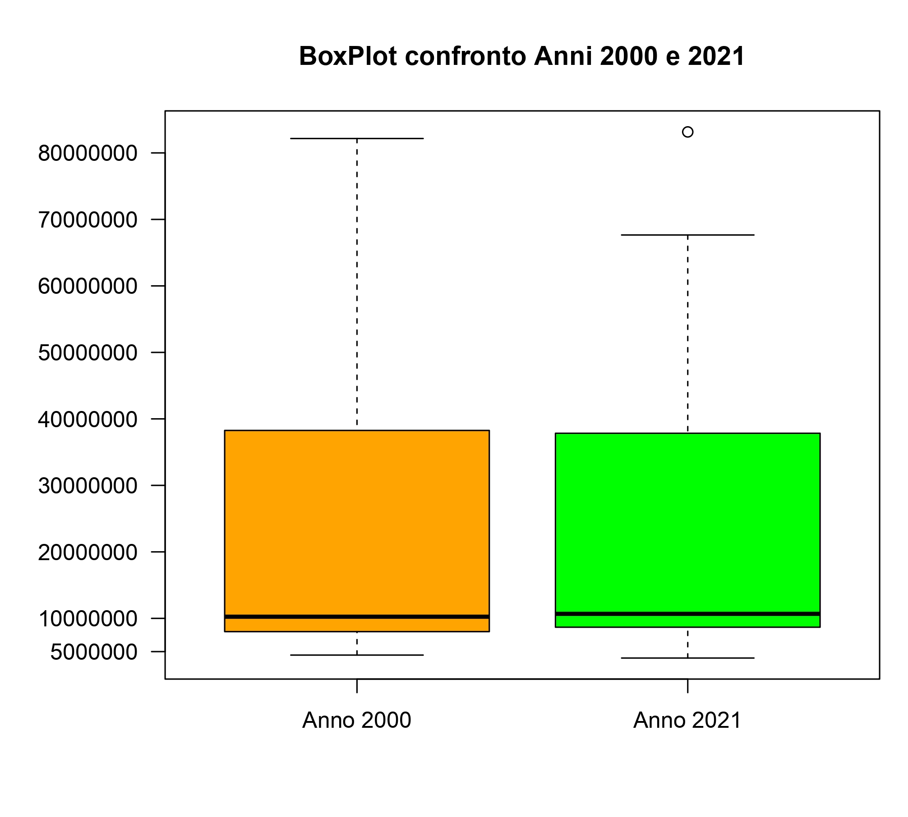
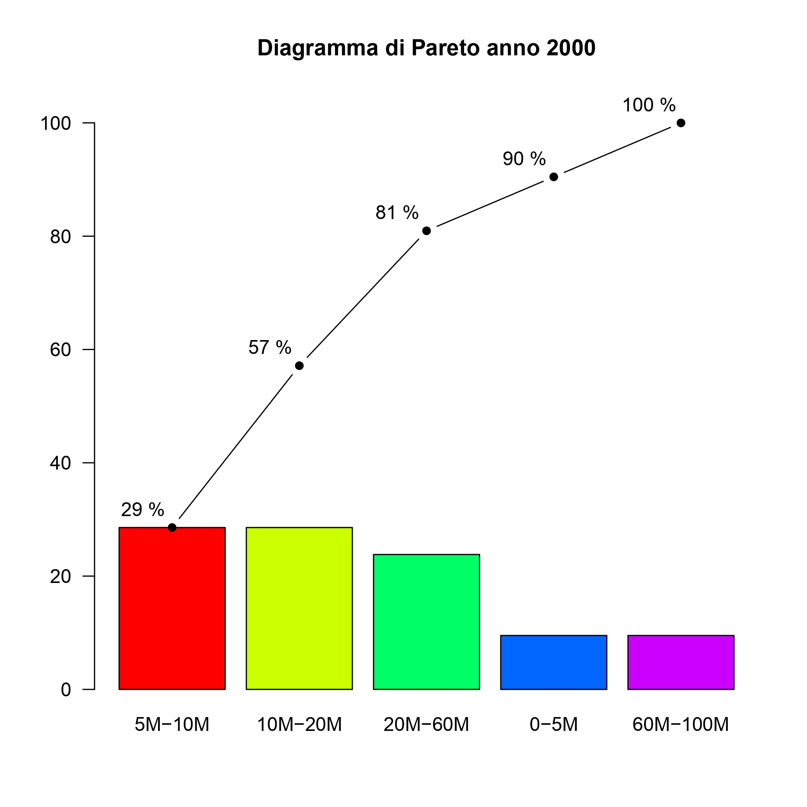
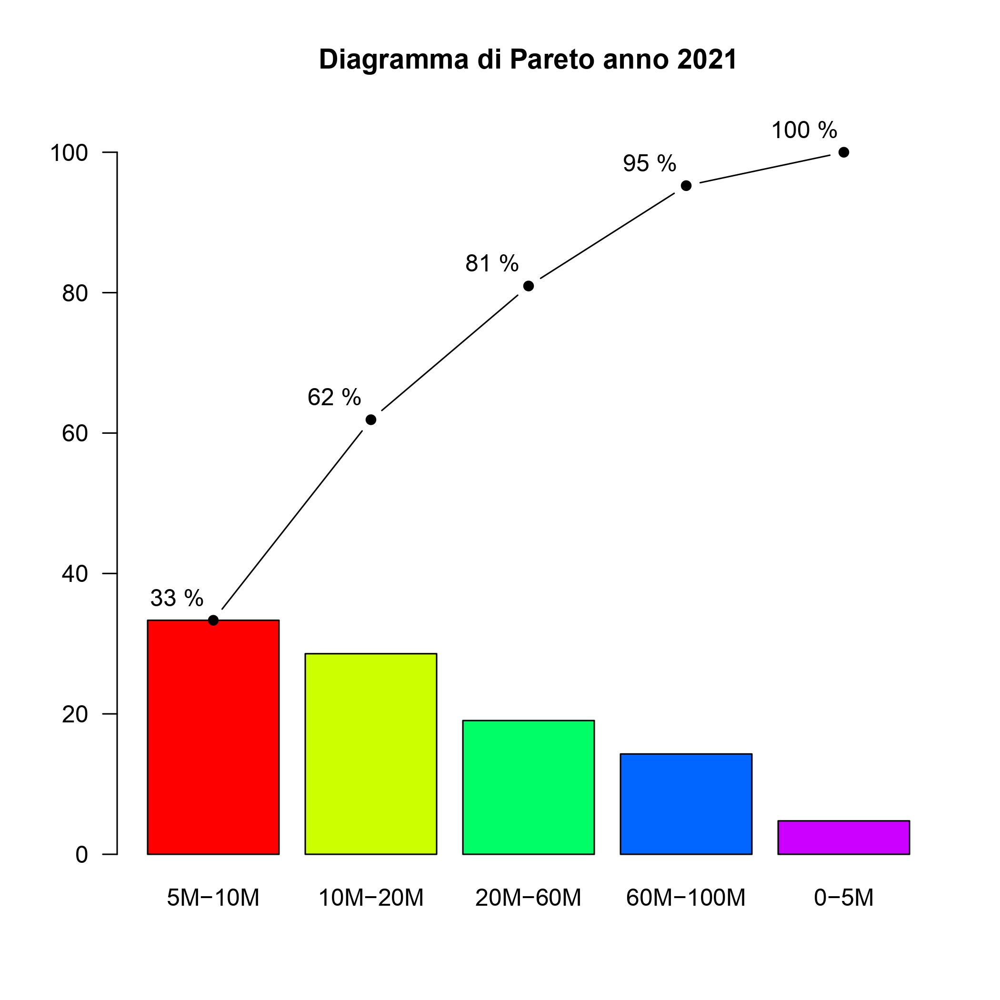
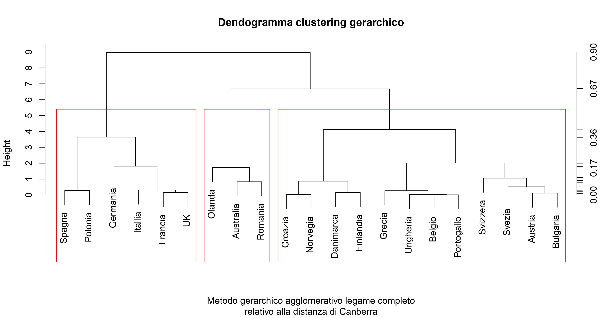
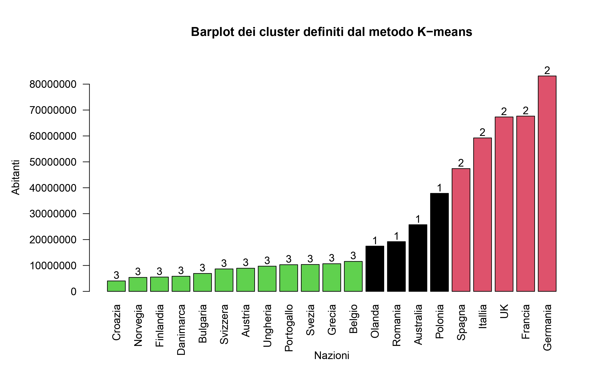

# 📈 Population Analysis of European Nations (2000–2021)

This repository contains the full documentation and R scripts for a statistical project developed as part of the **"Statistica e Analisi dei Dati"** course at the **University of Salerno** 🏫 (Academic Year 2023-2024). The project focuses on the analysis of population trends across 21 selected nations — mostly European — using a dataset provided by the OECD.

## 📁 Repository Contents

- `analysis.R`: All R code used for importing, cleaning, analyzing, and visualizing the dataset.
- `report.pdf`: Full academic report (in Italian) detailing the analysis and findings.
- `README.md`: Summary of the methodology and results (you're reading it!).

## 🧠 Project Objective

The goal of this project is to identify population trends over a 21-year period (2000–2021), distinguishing nations with:
- 📈 Constant or growing populations
- 📉 Declining populations
- ⚠️ Anomalies or turning points in demographic trends

## 📊 Dataset Overview

The dataset used in this study was sourced from the OECD and includes population data for major metropolitan areas. After filtering out cities and focusing only on countries, we selected **21 nations** based on geographic and demographic criteria.

### 📌 Nations Analyzed
Australia, Austria, Belgium, Bulgaria, Switzerland, Germany, Denmark, Spain, Finland, France, United Kingdom, Greece, Croatia, Hungary, Italy, Netherlands, Norway, Poland, Portugal, Romania, Sweden.


---

## 🔍 Visual Data Exploration

### 1. Time Series Plots 📆
Time series were used to monitor population evolution for each nation.

<p>
     
      &nbsp;&nbsp; &nbsp;&nbsp; &nbsp;&nbsp; &nbsp;&nbsp;
     
</p>

### 2. Barplots 📊
Barplots for each year help visualize how nations compare in terms of population size.

<p>
     
      &nbsp;&nbsp; &nbsp;&nbsp; &nbsp;&nbsp; &nbsp;&nbsp;
     
</p>

### 3. Frequency Distributions 📈
Population ranges were grouped into five classes (e.g., 0–5M, 5M–10M, etc.) and analyzed using:
- Barplots (absolute frequency)
- Pie charts (relative frequency)

### 4. Boxplots 📦
Useful to highlight variability, outliers, and central tendencies across time.
<p>
  
</p>

### 5. Pareto Charts 📐
Applied to show which nations contribute most to the overall population — a great way to highlight concentration.

<p>
     
      &nbsp;&nbsp; &nbsp;&nbsp; &nbsp;&nbsp; &nbsp;&nbsp;
     
</p>

---

## 📊 Descriptive Statistics

Both univariate and bivariate analyses were performed:
- **Central tendency**: Mean, median, mode
- **Dispersion**: Variance, standard deviation, coefficient of variation
- **Shape**: Skewness and kurtosis
- **Correlation and linear regression**: Relationships between years or between countries

---

## 🤖 Clustering Analysis

Two clustering techniques were applied:
- **Hierarchical clustering**: Dendrograms and scree plots revealed clear clusters based on population levels.
- **K-means clustering**: Confirmed and refined cluster definitions.

<p>
     
      &nbsp;&nbsp; &nbsp;&nbsp; &nbsp;&nbsp; &nbsp;&nbsp;
     
</p>

---

## 🧪 Inferential Statistics

- **Random variables**: Simulated population scenarios
- **Confidence intervals**: For various nations across different years
- **Hypothesis testing**: On population changes in specific countries (e.g., Italy, Australia)
- **Chi-squared test**: Applied to test independence or homogeneity across populations

---

## 🚀 Getting Started

To reproduce the analysis:

```r
# Clone repository
git clone https://github.com/yourusername/yourprojectname.git

# Open RStudio and run analysis.R
Make sure to have the necessary libraries installed (ggplot2, dplyr, etc.).
```
---

## 🧾 License
This project is for academic use only. Feel free to explore and learn!
